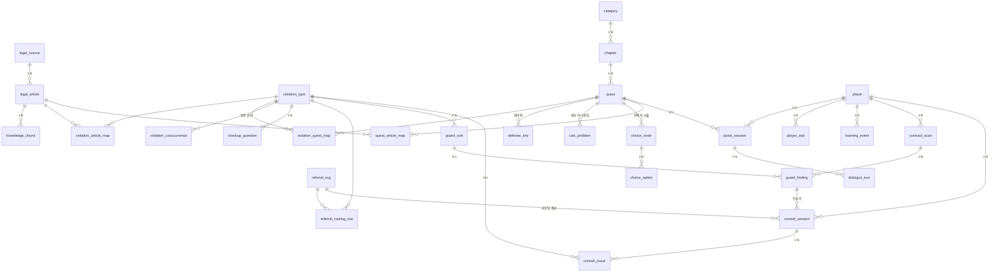

# 라이프 튜토리얼 — ERD

> **Status:** v1.0 (2026-08-03)
> **기준 문서:** [기획서(본선 제출본)]({{ "/docs/plan.html" | relative_url }}) — 서비스 4개 축(메인게임·미니게임·가드·상담 준비 리포트)과 기술 역할 분담 대원칙을 테이블 구조로 번역한다.
> **설계 규칙:** ① 모든 테이블 1NF→3NF 정규화, 역정규화는 명시적 근거 필수 ② 고립 테이블 금지 — 모든 테이블은 엣지로 연결 ③ **1 테이블 = 1 프랙탈 11-파일 세트 = 1 AI 위임 단위** ([개발 수행 지침]({{ "/docs/guidelines.html" | relative_url }}) 참조)

---

## 1. 전체 ERD

한 줄 요약: **`violation_type`(위반유형)이 온톨로지의 허브다.** 조문(게임 판정 근거) ↔ 퀘스트(학습 연결) ↔ 가드 룰(진단) ↔ 확인 질문(이슈 스포팅) ↔ 상담기관(라우팅)이 전부 이 허브를 경유해 연결된다 — 기획서 "매핑 테이블 대원칙"의 구현.

---

## 2. 법령 지식층 — "DB 원문 렌더링"의 근거 (ontology BC)

법령 사실관계가 화면·리포트에 뜨는 모든 곳은 DB 원문을 조문 ID로 조회해 그대로 렌더링한다. 그 단일 원천이 이 3개 테이블이다.

| 테이블 | 핵심 컬럼 | 비고 |
|---|---|---|
| `legal_source` | id, source_type(STATUTE/DECREE/RULE/ADMRUL/QA/GUIDELINE), name, effective_date | 법률·시행령·고시·질의회시·지침을 한 어휘로 — 수집 파이프라인의 적재 대상 |
| `legal_article` | id, source_id(FK), article_no, title, body_text, effective_date | **근거 조문 카드·리포트 인용의 유일한 원천** (LLM 생성 경로 없음) |
| `knowledge_chunk` | id, article_id(FK), chunk_index, chunk_text, embedding | RAG 검색용 청크. 벡터는 pgvector 컬럼(현 구현) — Port 격리로 외부 벡터 스토어 전환 가능 |

- **정규화 근거:** 원문(`legal_article`)과 검색 표현(`knowledge_chunk`)을 분리 — 청킹 전략이 바뀌어도 원문은 불변, 조문 개정 시 청크만 재생성 (2NF: 청크는 조문에 완전 종속).

## 3. 온톨로지 매핑 허브 (ontology BC)

| 테이블 | 핵심 컬럼 | 비고 |
|---|---|---|
| `violation_type` | id, code, name, default_severity | **허브.** 예: 최저임금 미달, 기재사항 누락, 위약금, 주휴수당 미지급, 해고예고 위반 |
| `violation_article_map` | violation_type_id, article_id | N:M — 위반유형 ↔ 근거 조문 |
| `violation_quest_map` | violation_type_id, quest_id | N:M — 위반유형 ↔ 추천 퀘스트 ("위약금 발견 → 근로계약서 쓰기 학습") |
| `violation_cooccurrence` | violation_type_id, related_violation_type_id, rationale | 동반 위반 지식 — "위약금이 있으면 임금체불·주휴수당·해고예고도 의심" |
| `checkup_question` | id, violation_type_id(FK), question_text, evidence_hint, display_order | 이슈 스포팅 확인 질문 세트 — "혹시 주휴수당은 받았어요?" |
| `referral_org` | id, name, org_type(RIGHTS_CENTER/LEGAL_AID/LOCAL_CENTER), region, contact, eligibility_note | 상담기관 디렉토리 (고용노동부·지자체 공공데이터) |
| `referral_routing_rule` | id, violation_type_id(FK), min_severity, max_age, region_cond, prior_step_cond, org_id(FK), priority | **결정적 라우팅** — "중대+만 24세 이하→근로권익센터 / 진정 후 미해결→법률구조공단". LLM 미개입 |

- **정규화 근거:** 라우팅 조건을 코드의 if/else가 아닌 데이터(`referral_routing_rule`)로 — 기관·조건 변경 시 코드 수정 없이 행 교체. 동반 위반도 하드코딩이 아닌 N:M 테이블 — 노무사 검증 시 데이터만 감수하면 된다.

## 4. 게임 — 메인게임 + 미니게임 2종 (quest / npc BC)

| 테이블 | 핵심 컬럼 | 비고 |
|---|---|---|
| `category` | id, name(금융/노동/생활법률) | 커리큘럼 최상위 |
| `chapter` | id, category_id(FK), title, display_order | "알바 연대기" = 노동 카테고리의 챕터 1 |
| `quest` | id, chapter_id(FK), title, mechanism(DIALOGUE/CALC/CHOICE), target_seconds, clear_condition | 메커니즘 enum — 정식 출시 시 DOC/ORDER 등 확장 |
| `defense_line` | id, quest_id(FK), level(1~3), npc_opening, clear_criteria | 대화 방어전 3단 — 회피/지연/회유·협박 |
| `calc_problem` | id, quest_id(FK), prompt, given_params(JSON), answer, explanation | 주휴수당 계산 던전 — LLM 불요, 정답·해설 데이터가 전부 |
| `choice_node` | id, quest_id(FK), parent_option_id(FK, nullable), situation_text | 선택지 시뮬레이션 분기 트리 |
| `choice_option` | id, node_id(FK), option_text, explanation, next_node_id(FK, nullable) | 선택별 해설 — 민감 주제 안전 설계의 콘텐츠 단위 |
| `quest_article_map` | quest_id, article_id | N:M — 퀘스트 ↔ 판정 근거 조문 (RAG 검색 범위 한정에도 사용) |

- **정규화 근거:** 메커니즘별 콘텐츠(`defense_line`/`calc_problem`/`choice_node`)를 `quest`에 JSON으로 넣지 않고 별도 테이블로 분리 (1NF + 메커니즘별 독립 프랙탈 셋 = AI 위임 단위 분리).

## 5. 플레이어 · 세션 · 로그 (quest / insight BC)

| 테이블 | 핵심 컬럼 | 비고 |
|---|---|---|
| `player` | id, nickname, birth_year, created_at | 최소 수집 원칙 — 연령 인증 파생값(출생연도)만, 실명·재학증명 없음 |
| `player_stat` | player_id, stat_code(CREDIT/MENTAL/ASSET/LAW), value | 스탯 4종 — 컬럼 나열 대신 행 분리 (1NF, 스탯 추가 시 스키마 불변) |
| `quest_session` | id, player_id(FK), quest_id(FK), status, checkpoint, started_at, cleared_at | 체크포인트 이어하기 |
| `dialogue_turn` | id, session_id(FK), role, text, defense_level, judgement(ONGOING/CLEAR/HINT_NEEDED) | 저장 전 PII 마스킹 — 파인튜닝 데이터 원천 |
| `learning_event` | id, player_id(FK), event_type, payload(JSON), created_at | 익명 이벤트만 — KPI(완주율·이탈)와 기관 집계 리포트의 원천 |

## 6. 가드 + 상담 준비 리포트 (guard / report BC)

**개인정보 설계가 곧 스키마 설계다:** 계약서 이미지·추출 원문·인터뷰 답변 내용을 담는 컬럼이 **존재하지 않는다.** "저장 후 파기"가 아니라 저장할 자리가 없는 구조.

| 테이블 | 핵심 컬럼 | 비고 |
|---|---|---|
| `contract_scan` | id, player_id(FK), status, scanned_at | 스캔 세션 메타데이터만 — 이미지·원문 컬럼 없음 |
| `guard_rule` | id, code, violation_type_id(FK), severity, condition_spec(JSON), version, verified_by, verified_at | 결정적 룰셋 — 노무사 검증·버전 기록 필수. `violation_type` 연결로 온톨로지 허브 편입 |
| `guard_finding` | id, scan_id(FK), rule_id(FK), rule_version, created_at | 판정 결과. severity는 저장하지 않고 rule_id+rule_version으로 참조 (3NF — 룰에 종속된 값 중복 금지, 버전 고정으로 감사 가능) |
| `consult_session` | id, player_id(FK), trigger_finding_id(FK), status, routed_org_id(FK→referral_org), created_at, purged_at | 인터뷰 세션 메타데이터. **답변 내용·타임라인·PDF는 비저장** — 생성 즉시 기기 전달 후 서버 파기 |
| `consult_issue` | id, consult_session_id(FK), violation_type_id(FK), source(RULESET/CHECKLIST/RAG), status(CONFIRM_REQUESTED/UNCONFIRMED) | 쟁점을 **유형 코드로만** 기록 — 이슈 스포팅 효과 측정은 가능하되 사실관계 내용은 남지 않음 |

- **관계 축:** `guard_finding` → (트리거) → `consult_session` → `consult_issue` → `violation_type` → `checkup_question`(질문 세트) · `violation_cooccurrence`(동반 위반) · `referral_routing_rule`(기관 매칭). 상담 준비 인터뷰 흐름이 그대로 엣지 경로다.

---

**역정규화 현황: 없음.** 전 테이블 3NF. 향후 성능상 역정규화가 필요해지면 본 문서에 근거를 명시하고 추가한다.

**고립 테이블 검증:** 전 테이블이 최소 1개 엣지로 연결됨 — `player`(세션·스탯·이벤트·스캔·상담), `violation_type`(6개 엣지 허브), `legal_article`(청크·매핑·리포트 인용). ✅

---

> **문서 관리:** 본 ERD는 기획서 v1.0 기준. 가드·리포트는 정식 출시 범위(P2)이므로 해당 테이블군(§6)은 스캐폴딩만 선반영 가능하고 본선 MVP 구현 대상이 아니다. 원본은 개발 리포지토리 `docs/ERD.md`에서 관리하며, 변경 시 본 페이지를 함께 갱신한다.

[← 목차로]({{ "/docs/toc.html" | relative_url }})
