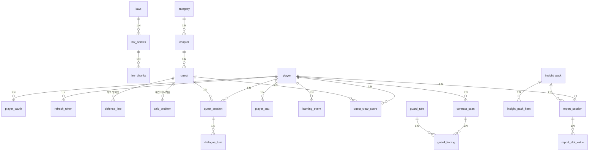

# 라이프 튜토리얼 — ERD

> **Status:** v2.0 (2026-08-28) — **구현 스키마 기준.** 백엔드 `apps/*/adapter/outbound/orm*/` 의 SQLAlchemy ORM 정의가 원본이며 본 문서는 그것을 그대로 옮긴 것이다. 코드와 문서가 어긋나면 코드가 맞다.
> **이력:** v1.0 (2026-08-03)은 [기획서(본선 제출본)]({{ "/docs/plan.html" | relative_url }}) 기반 설계 초안 — 설계 대비 구현 변경분은 §8.
> **설계 규칙:** ① 모든 테이블 1NF→3NF 정규화, 역정규화는 명시적 근거 필수 ② 고립 테이블 금지 — 모든 테이블은 엣지로 연결 ③ **1 테이블 = 1 프랙탈 11-파일 세트 = 1 AI 위임 단위** ([개발 수행 지침]({{ "/docs/guidelines.html" | relative_url }}) 참조)

---

## 1. 전체 ERD (구현 기준 — 23 테이블, 5 BC)

한 줄 요약: **`player`가 런타임의 허브, `quest`·`insight_pack`이 콘텐츠의 허브다.** v1.0 설계의 `violation_type` 온톨로지 허브 테이블군은 미구현 — 위반유형은 현재 `guard_rule.violation_type_code`(문자열 코드)와 `insight_pack_item`(kind=ISSUE) 데이터 행으로 표현된다 (§8).

---

## 2. 법령 지식층 — "DB 원문 렌더링"의 근거 (ontology BC)

기획서 §2: 법령 사실관계가 화면·리포트에 뜨는 모든 곳은 DB 원문을 조문 ID로 조회해 그대로 렌더링한다. 그 단일 원천이 이 3개 테이블이다.

| 테이블 | 컬럼 | 비고 |
|---|---|---|
| `laws` | id, mst(UQ), name, effective_date, fetched_at | 법령 원부 — 국가법령정보 MST 키로 수집·적재 |
| `law_articles` | id, law_id(FK), article_no, title, content · UQ(law_id, article_no) | **근거 조문 카드·리포트 인용의 유일한 원천** (LLM 생성 경로 없음) |
| `law_chunks` | id, article_id(FK), chunk_no, content, embedding(vector 1536), model, embedded_at, embedding_local, model_local, embedded_local_at | RAG 검색용 청크. pgvector — **provider별 벡터 컬럼 2쌍(gemini/로컬) 공존** |

- **정규화 근거:** 원문(`law_articles`)과 검색 표현(`law_chunks`)을 분리 — 청킹 전략이 바뀌어도 원문은 불변, 조문 개정 시 청크만 재생성.
- **역정규화(명시):** `law_chunks`의 임베딩 컬럼 2쌍은 P0-4 "임베딩 프로바이더 즉시 전환" 요건에 따른 **의도적 역정규화** — 별도 테이블 분리 대신 컬럼 2쌍 고정 (ORM 주석에 근거 명시).

## 3. 인증 · 플레이어 (auth BC)

| 테이블 | 컬럼 | 비고 |
|---|---|---|
| `player` | id, username(UQ), password_hash, birth_year, created_at | 최소 수집 원칙 — 연령 파생값(출생연도)만, 실명·재학증명 없음. password_hash는 OAuth 전용 계정이면 NULL |
| `player_oauth` | id, player_id(FK), provider, provider_subject · UQ(provider, provider_subject) | 소셜 로그인 연결 — 한 계정에 복수 프로바이더 가능 |
| `refresh_token` | id, player_id(FK), token_hash(UQ), expires_at, revoked_at, created_at | 토큰 원문 비저장 — 해시만. 회전·폐기 이력 |

## 4. 게임 — 메인게임 + 미니게임 (quest BC)

| 테이블 | 컬럼 | 비고 |
|---|---|---|
| `category` | id, name | 커리큘럼 최상위 (금융/노동/생활법률) |
| `chapter` | id, category_id(FK), title, display_order | "알바 연대기" = 노동 카테고리의 챕터 1 |
| `quest` | id, chapter_id(FK), title, mechanism, display_order, money_defended, clear_reward(JSONB) | mechanism: DIALOGUE/CALC (CHOICE는 미구현 — §8). money_defended = "지킨 돈" 연출값 |
| `defense_line` | id, quest_id(FK), level, npc_opening, npc_clear, ongoing_lines(JSONB), hint1, hint2, keywords_clear(JSONB), keywords_ambig(JSONB), keywords_ambig_priority(JSONB), evidence(JSONB) · UQ(quest_id, level) | 대화 방어전 3단 — 판정 키워드·힌트·근거를 전부 데이터로 (판정은 결정적, LLM은 연출만) |
| `calc_problem` | id, quest_id(FK), code, display_order, prompt_template, given_params(JSONB), answer_kind, explanation_template, is_trap · UQ(quest_id, code) | 계산 던전 — LLM 불요, 정답·해설 데이터가 전부. is_trap = 함정 문제 |
| `quest_session` | id, player_id(FK), quest_id(FK), status, checkpoint, turn_in_level, ongoing_index, total_turns, hints_used, calc_progress(JSONB), started_at, cleared_at | 체크포인트 이어하기 + 방어전/계산 진행 상태 |
| `dialogue_turn` | id, session_id(FK), role, text, defense_level, judgement, created_at | 방어전 대화 로그 — 저장 전 PII 마스킹 |
| `player_stat` | player_id(FK)+stat_code(복합 PK), value | 스탯 — 컬럼 나열 대신 행 분리 (1NF, 스탯 추가 시 스키마 불변) |
| `quest_clear_score` | player_id(FK)+quest_id(FK)(복합 PK), clear_count, initial_reward(JSONB), recent_reward(JSONB), updated_at | 퀘스트별 클리어 집계 — 첫 보상/최근 보상 구분 (재도전 보상 체감용) |
| `learning_event` | id, player_id(FK), event_type, payload(JSONB), created_at | 익명 이벤트 — KPI(완주율·이탈)와 집계 리포트의 원천 |

- **정규화 근거:** 메커니즘별 콘텐츠(`defense_line`/`calc_problem`)를 `quest`에 JSON으로 넣지 않고 별도 테이블로 분리 (메커니즘별 독립 프랙탈 셋 = AI 위임 단위 분리).

## 5. 가드 — 계약서 진단 (guard BC)

**개인정보 설계:** 계약서 **이미지·OCR 원문은 컬럼이 없어 저장 불가.** 사용자가 확인한 구조화 필드(`confirmed_fields`)만 진단에 필요한 동안 보관하고 파기 시각을 컬럼으로 남긴다 — "저장할 자리가 없는" 층과 "저장 후 파기를 기록하는" 층의 2단 구조.

| 테이블 | 컬럼 | 비고 |
|---|---|---|
| `contract_scan` | id, player_id(FK), doc_type, status, template_matched, scanned_at, image_purged_at, fields_purged_at, confirmed_fields(JSONB) | 스캔 세션. 이미지·OCR 원문 컬럼 없음. confirmed_fields는 사용자 확인 후 확정된 필드만 — 파기 시 NULL + fields_purged_at 기록 |
| `guard_rule` | id, code, version, doc_type, violation_type_code, severity, condition_spec(JSONB), verified_by, verified_at | 결정적 룰셋 — 노무사 검증·버전 기록. 위반유형은 문자열 코드 (허브 테이블 미구현 — §8) |
| `guard_finding` | id, scan_id(FK), rule_id(FK), rule_version, created_at | 판정 결과. severity는 저장하지 않고 rule_id+rule_version으로 참조 (3NF — 룰에 종속된 값 중복 금지, 버전 고정으로 감사 가능) |

## 6. 상담 준비 리포트 (insight BC)

v1.0 설계의 `consult_session`/`consult_issue` + `checkup_question`/`referral_org`/`referral_routing_rule`를 **팩(콘텐츠) / 세션(런타임) 2층 4테이블로 재설계**해 구현했다. 질문 세트·쟁점·증거 팁·기관 라우팅이 전부 `insight_pack_item`의 **데이터 행**(kind 구분)이므로 콘텐츠 추가·노무사 감수 시 코드 수정이 없다.

| 테이블 | 컬럼 | 비고 |
|---|---|---|
| `insight_pack` | id, category(UQ), track, secondary_track, urgent, implemented, urgent_notice, evidence_notice, law_query | 상담 카테고리별 콘텐츠 팩 — law_query로 법령 지식층(RAG) 검색 범위 한정 |
| `insight_pack_item` | id, pack_id(FK), kind(SLOT/ISSUE/EVIDENCE_TIP/ROUTING), slot_id, order_no, required, value_type(TEXT/DATE/MONEY), label, question, text, reason, contact, expert | 팩 구성 요소 — 인터뷰 질문(SLOT), 쟁점(ISSUE), 증거 팁, 기관 라우팅을 한 테이블의 행으로 |
| `report_session` | id, player_id(FK), pack_id(FK), status(INTERVIEW/CONFIRM/GENERATED/PURGED), narrative, current_slot_id, reask_used, confirmed_at, retention_expires_at, extension_count, created_at, purged_at | 인터뷰~리포트 세션. narrative는 파기 대상. **보존 30일 + 최대 2회 연장**(retention_expires_at, extension_count) 후 lazy purge + sweep |
| `report_slot_value` | id, session_id(FK), slot_id, value, precision(EXACT/APPROX_MONTH/APPROX_RANGE/HEARSAY/UNKNOWN), raw_quote, source | 슬롯별 답변 — value·raw_quote는 파기 대상. precision으로 진술 확실성을 구조화 (리포트 신뢰도 표기 근거) |

- **개인정보 설계:** 답변 내용(value, raw_quote)과 리포트 본문(narrative)은 **보존 기한이 컬럼에 박혀 있고**(retention_expires_at), 만료 시 내용 컬럼을 비우고 purged_at을 기록한다. 회원 탈퇴/초기화 시 세션 일괄 파기(Composite wipe).
- **정규화 근거:** 슬롯 값을 세션에 JSON으로 넣지 않고 행 분리(`report_slot_value`) — 슬롯 추가 시 스키마 불변, precision 등 슬롯 단위 메타 유지.

---

## 7. 역정규화 · 고립 테이블 검증

**역정규화 현황 (2건, 근거 명시):**

| 위치 | 내용 | 근거 |
|---|---|---|
| `law_chunks` | 임베딩 컬럼 2쌍(gemini/로컬) 공존 | P0-4 임베딩 프로바이더 즉시 전환 요건 — 재임베딩 없이 컬럼 전환 |
| `guard_finding.rule_version` | rule_id가 있음에도 판정 시점 버전을 중복 보관 | 룰 개정 후에도 과거 판정의 근거 버전 감사 가능 (감사 추적) |

**고립 테이블 검증:** 전 테이블이 최소 1개 엣지로 연결됨 — `player`(oauth·토큰·세션·스탯·이벤트·스캔·리포트 7축), `quest`(방어전·계산·세션·클리어), `insight_pack`(아이템·세션), `laws`(조문·청크). ✅

단, **BC 간에는 FK를 두지 않는 경계가 2곳 있다** (모듈러 모놀리스 — BC 간 참조는 ID/코드로만):
- `guard_rule.violation_type_code` ↔ insight/quest: 문자열 코드로 느슨하게 연결
- `insight_pack.law_query` ↔ `law_articles`: FK가 아닌 검색 조건으로 연결 (RAG 범위 한정)

---

## 8. v1.0 설계 대비 구현 변경분

| 구분 | 내용 | 사유 |
|---|---|---|
| **개명** | `legal_source`→`laws`, `legal_article`→`law_articles`, `knowledge_chunk`→`law_chunks` | 국가법령정보 수집 파이프라인(MST 키) 기준으로 어휘 정리 |
| **재설계** | `consult_session`/`consult_issue`/`checkup_question`/`referral_org`/`referral_routing_rule` → `insight_pack`/`insight_pack_item`/`report_session`/`report_slot_value` | 질문·쟁점·팁·라우팅을 팩 아이템 데이터 행으로 통합 — 테이블 5→4개, 콘텐츠 추가 시 스키마 불변 |
| **신규** | `player_oauth`, `refresh_token`, `quest_clear_score` | 소셜 로그인·토큰 회전, 재클리어 보상 집계 |
| **변경** | `report_session`에 retention_expires_at, extension_count 추가 (v0.15.6) | 리포트 30일 보존 + 최대 2회 연장 정책 |
| **변경** | `contract_scan`에 doc_type, template_matched, confirmed_fields, image/fields_purged_at 추가 | OCR 진단 실구현 — 확인 필드 보관 + 파기 시각 기록 |
| **변경** | `guard_rule.violation_type_id(FK)` → `violation_type_code`(문자열) | violation_type 허브 테이블 미구현 — BC 간 코드 참조로 대체 |
| **미구현 (P2 이월)** | `violation_type`, `violation_article_map`, `violation_quest_map`, `violation_cooccurrence`, `quest_article_map`, `choice_node`, `choice_option` | 온톨로지 허브 테이블군·선택지 시뮬은 본선 MVP 범위 밖 — 정식 출시 시 v1.0 설계 의도대로 승격 예정 |

---

> **문서 관리:** 본 ERD는 구현 스키마(ORM)를 기준으로 한다. 테이블·컬럼 추가/변경 시 해당 BC 섹션과 §8 변경분 표를 갱신하고 각 테이블 구현 시 프랙탈 11-파일 세트를 따른다. v1.0 설계 초안의 온톨로지 허브 구상은 §8 미구현 행으로만 남긴다.

